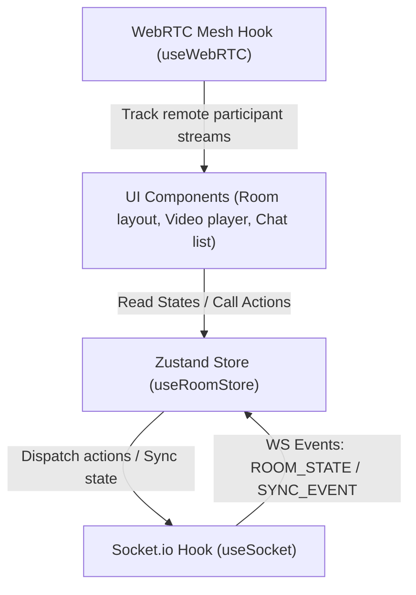

# WatchVerse System Architecture

Welcome to the **WatchVerse** system architecture documentation. WatchVerse is a premium, enterprise-grade collaborative video-watching (watch party) application. It enables multiple users in a single virtual room to sync their video players (YouTube, HLS, direct stream, Twitch, etc.) in real-time, while simultaneously communicating via WebRTC video/audio chat and instant messaging.

This document details the high-level architecture, module breakdown, networking protocols, and real-time state synchronization design of the WatchVerse monorepo.

---

## 1. High-Level System Architecture

WatchVerse is architected as a modular monorepo utilizing a high-efficiency decoupled frontend-backend architecture.

```mermaid
graph TD
    %% Clients
    subgraph Clients ["Web Clients (React/Next.js)"]
        UserA["Client A (Host)"]
        UserB["Client B (Peer)"]
    end

    %% Routing / Proxy Layer
    subgraph Routing ["Routing & Reverse Proxy"]
        Nginx["Nginx Reverse Proxy (Port 80/443)"]
    end

    %% Frontend App
    subgraph FrontendApp ["Frontend Application Layer"]
        NextJS["Next.js App Router (Port 3000)"]
    end

    %% Backend App
    subgraph BackendApp ["NestJS Microservices Layer (Port 3001)"]
        NestCore["NestJS Application Core"]
        RoomGateway["Room Socket.io Gateway"]
        RoomService["Room State Service"]
        TurnService["Ephemeral TURN Credential Service"]
    end

    %% Infrastructure & Core Services
    subgraph Storage ["Storage & Cache Layers"]
        MongoDB[("MongoDB Database (Port 27017)")]
        Redis[("Redis Memory Store (Port 6379)")]
    end

    subgraph MediaRelay ["WebRTC NAT Traversal Relay"]
        Coturn["Coturn TURN/STUN Server (Port 3478)"]
    end

    %% Connectivity
    UserA <-->|HTTP / HTTPS| Nginx
    UserB <-->|HTTP / HTTPS| Nginx
    Nginx <-->|Reverse Proxy| NextJS
    Nginx <-->|Reverse Proxy| NestCore
    
    %% Socket IO WS Connections
    UserA <-->|WebSockets (Socket.io)| RoomGateway
    UserB <-->|WebSockets (Socket.io)| RoomGateway

    %% WebRTC Signaling & P2P Stream
    UserA <-->|WebRTC Signaling| RoomGateway
    UserB <-->|WebRTC Signaling| RoomGateway
    UserA <===>|WebRTC P2P Stream (Direct UDP/TCP)| UserB
    
    %% WebRTC NAT Traversal (Fallback via TURN)
    UserA <--->|STUN/TURN Queries| Coturn
    UserB <--->|STUN/TURN Queries| Coturn
    UserA ===>|WebRTC Relayed Media Stream| Coturn
    Coturn ===>|WebRTC Relayed Media Stream| UserB

    %% Internal Backend Integrations
    NestCore <-->|Room & User Persistence| MongoDB
    NestCore <-->|Redis Pub/Sub Socket Adapter| Redis
    NestCore -.->|Dynamic HMAC Signature| Coturn
```

### Key Architectural Pillars
1. **Next.js Frontend (App Router)**: Renders a state-of-the-art interactive workspace, containing custom video players, WebRTC camera/audio grids, screen sharing layouts, and real-time chat boxes.
2. **NestJS Backend**: A modular, progressive Node.js framework providing API endpoints (e.g. dynamic TURN generation) and the WebSocket (Socket.io) server.
3. **WebRTC Peer-to-Peer Mesh**: Local streams are exchanged directly between participants. To bypass symmetric NATs and firewalls, **Coturn** acts as the STUN/TURN server, generating dynamic relayed channels.
4. **Decoupled shared Packages**: Shared typescript definitions (`packages/types`) guarantee compile-time type safety across both frontend and backend directories.

---

## 2. Directory Layout & Monorepo Structure

The project utilizes **npm workspaces** to handle internal dependencies seamlessly. The monorepo has three main workspace components:

```text
WatchVerse/
├── apps/
│   ├── frontend/             # Next.js Web App
│   │   ├── src/
│   │   │   ├── app/          # App Router (Home & Room pages)
│   │   │   ├── components/   # UI/UX, Chat, Video and Room Panels
│   │   │   ├── hooks/        # Core React Hooks (useWebRTC, useSocket)
│   │   │   └── store/        # React Reactive Store (Zustand)
│   │   └── package.json
│   │
│   └── backend/              # NestJS Gateway & API App
│       ├── src/
│       │   ├── room/         # Room Gateway, Service, Turn Controller & Service
│       │   ├── app.module.ts # NestJS Module bootstrap
│       │   └── main.ts       # Application runner
│       └── package.json
│
├── packages/
│   └── types/                # Unified TypeScript interfaces (cross-shared package)
│       ├── src/index.ts      # Room, User, ChatMessage, MediaState Types
│       └── package.json
│
├── infra/                    # Deployment Infrastructure Configuration
│   ├── coturn/               # Coturn Server Configuration templates
│   ├── nginx/                # Reverse proxy files for development/prod routing
│   ├── backend.Dockerfile    # Docker recipe for the NestJS microservice
│   └── frontend.Dockerfile   # Docker recipe for the Next.js static/ssr server
│
├── docker-compose.yml        # Orchestration definition for local/prod setup
├── package.json              # Monorepo Workspace settings
└── .env                      # Global system configuration environment variables
```

---

## 3. WebRTC Signaling & NAT Traversal

Establishing a peer-to-peer connection requires a signaling channel to negotiate codecs, ICE candidates, and connection parameters.

### Ephemeral TURN Credentials Flow
To maintain security, WatchVerse implements the **standard REST API auth specifications (RFC 5766)** for TURN access. A static secret is shared between NestJS and Coturn. When a client enters a room:
1. The client requests credentials from `GET /api/turn-credentials?userId=...`
2. **TurnService** computes an HMAC-SHA1 signature using the secret and an expiration timestamp.
3. The client instantiates `RTCPeerConnection` with the returned ephemeral servers and dynamic username/password.

### Signaling Protocol Flow
Below is the sequence diagram illustrating how clients coordinate via the NestJS **RoomGateway** to establish direct media streams.

```mermaid
sequenceDiagram
    autonumber
    actor ClientA as Client A (Host)
    participant WS as NestJS Socket Gateway
    actor ClientB as Client B (Peer)
    participant TURN as Coturn (STUN/TURN)

    %% Session joining
    ClientA->>WS: JOIN_ROOM { roomId, userId }
    WS-->>ClientA: ROOM_STATE { participants: [ClientA] }

    Note over ClientB: Client B joins the room
    ClientB->>WS: JOIN_ROOM { roomId, userId }
    WS-->>ClientB: ROOM_STATE { participants: [ClientA, ClientB] }
    WS->>ClientA: USER_JOINED { userId: ClientB }

    %% Peer Connection Setup (Negotiation)
    Note over ClientA, ClientB: Step 1: Query Ephemeral TURN credentials
    ClientA->>WS: GET /api/turn-credentials
    WS-->>ClientA: Return TURN servers + Dynamic HMAC Credentials
    ClientB->>WS: GET /api/turn-credentials
    WS-->>ClientB: Return TURN servers + Dynamic HMAC Credentials

    Note over ClientA, ClientB: Step 2: Establish RTCPeerConnection
    ClientA->>ClientA: Initialize RTCPeerConnection (with ICE configuration)
    ClientA->>ClientA: Add Camera & Microphone tracks
    ClientB->>ClientB: Initialize RTCPeerConnection (with ICE configuration)
    ClientB->>ClientB: Add Camera & Microphone tracks

    %% SDP Negotiation
    Note over ClientA, ClientB: Step 3: SDP Offer & Answer (Signaling)
    ClientA->>ClientA: Create Session SDP Offer
    ClientA->>WS: SIGNALING { targetId: ClientB, signal: Offer }
    WS->>ClientB: SIGNALING { senderId: ClientA, signal: Offer }
    ClientB->>ClientB: Set Remote Description (Offer)
    ClientB->>ClientB: Create Session SDP Answer
    ClientB->>WS: SIGNALING { targetId: ClientA, signal: Answer }
    WS->>ClientA: SIGNALING { senderId: ClientB, signal: Answer }
    ClientA->>ClientA: Set Remote Description (Answer)

    %% ICE Candidate Exchange
    Note over ClientA, ClientB: Step 4: ICE Candidate Trickling
    ClientA->>TURN: Connect, discover reflex/relay address
    TURN-->>ClientA: Return ICE Candidate (reflex/relay info)
    ClientA->>WS: SIGNALING { targetId: ClientB, signal: ICE Candidate }
    WS->>ClientB: SIGNALING { senderId: ClientA, signal: ICE Candidate }
    ClientB->>ClientB: Add ICE Candidate to Peer Connection
    
    ClientB->>TURN: Connect, discover reflex/relay address
    TURN-->>ClientB: Return ICE Candidate (reflex/relay info)
    ClientB->>WS: SIGNALING { targetId: ClientA, signal: ICE Candidate }
    WS->>ClientA: SIGNALING { senderId: ClientB, signal: ICE Candidate }
    ClientA->>ClientA: Add ICE Candidate to Peer Connection

    %% P2P Media Stream
    Note over ClientA, ClientB: Connection Established! Direct Media Exchange
    ClientA<===>ClientB: WebRTC Peer-to-Peer Mesh (Media & Audio streams)
```

### Connection Resilience & Polite Peer Pattern
To eliminate negotiation glare (both peers sending offers simultaneously):
* One peer is marked **polite** (non-initiator / receiver).
* The other peer is **impolite** (initiator / offerer).
* If a signaling collision (glare) occurs, the polite peer automatically rolls back its own offer and sets the incoming remote offer, maintaining seamless negotiation.
* The frontend incorporates automated **ICE Restart** hooks. If a peer's connection state shifts to `disconnected` or `failed`, the initiator fires a renewed offer with `iceRestart: true` to self-heal the communication pipe.

---

## 4. Collaborative Media Playback Synchronization

Synchronizing media across multiple clients requires maintaining a single source of truth on the server while resolving latency-based drifts locally.

```mermaid
flowchart LR
    Host["User A (Host Player)"]
    Server["NestJS Backend (RoomService)"]
    Peer["User B (Peer Player)"]

    Host -->|1. Event: PLAY/SEEK (SyncMessage)| Server
    Server -->|2. Persist MediaState in Memory| Server
    Server -->|3. Broadcast SYNC_EVENT| Peer
    Peer -->|4. Parse Time & Playback Drift| Peer
    Peer -->|5. Apply Seek / Playback Rate Adjust| Peer
```

### Synchronization Logic
1. **State Update Trigger**: A user interacts with the local video controls (Play, Pause, Seek).
2. **WS Dispatch**: The frontend dispatches a `SYNC_EVENT` event with a `SyncMessage` package containing:
   * Event type (`play` | `pause` | `seek` | `change_media`)
   * Video status (current time, play/pause status, media URL)
   * Client-side timestamp.
3. **Backend Broker**: The NestJS gateway receives the sync message, delegates to `RoomService` to persist the updated `MediaState` in-memory, and broadcasts the event to all other client sockets in the room.
4. **Drift Adjustment (Frontend)**:
   * When a client receives a `SYNC_EVENT` or a `ROOM_STATE` snapshot, it measures the network round-trip time.
   * If the current local video time differs from the calculated remote video time by **more than 1.5 seconds**, the local player seeks directly to the target time.
   * If the drift is smaller (e.g. 100ms - 500ms), the player is allowed to self-adjust or play without interrupting user experience, ensuring smooth, non-disruptive viewing.

---

## 5. Unified State Store (Zustand)

State management in the frontend is centralized within **Zustand**, establishing a clean, decoupled layer between UI components and networking hooks.



* **Dynamic State Sync**: Sockets and WebRTC hooks listen to events from the network and directly fire mutations on `useRoomStore`.
* **Instant Reactivity**: All React components subscribe to fine-grained selectors on `useRoomStore`, avoiding manual prop-drilling or messy context provider re-renders.

---

## 6. Shared Architecture Types

Compile-time system agreement is achieved through the shared types defined in `@watchverse/types`. This represents the exact payload layouts agreed upon by the backend NestJS service and Next.js client.

```typescript
export type MediaProvider = 'youtube' | 'spotify' | 'hls' | 'direct' | 'twitch' | 'vimeo';

export interface MediaState {
  provider: MediaProvider;
  url: string;
  title: string;
  thumbnail?: string;
  playing: boolean;
  currentTime: number;
  duration: number;
  lastUpdated: number; // Server timestamp
}

export interface User {
  id: string;
  username: string;
  avatar?: string;
  status: 'online' | 'offline' | 'away';
}

export interface Room {
  id: string;
  name: string;
  ownerId: string;
  participants: User[];
  media: MediaState;
  settings: {
    isPrivate: boolean;
    password?: string;
    anyoneCanControl: boolean;
  };
}

export interface SyncMessage {
  roomId: string;
  userId: string;
  type: 'play' | 'pause' | 'seek' | 'change_media';
  payload: Partial<MediaState>;
  timestamp: number;
}

export interface ChatMessage {
  id: string;
  roomId: string;
  senderId: string;
  username: string;
  content: string;
  timestamp: number;
}
```

---

## 7. Scaling and Enterprise Production Topology

To take WatchVerse from a local environment to a production deployment serving thousands of active rooms, the architecture is designed to scale horizontally:

1. **MongoDB persistence**:
   * Migrate backend `Map<string, Room>` in `RoomService` to MongoDB using `@nestjs/mongoose`. This guarantees room persistence and allows features like chat logs recovery.
2. **Redis horizontal scale-out**:
   * Integrate `@socket.io/redis-adapter` into the NestJS server.
   * When scaling the backend horizontally across multiple containers (e.g. in Kubernetes), this adapter broadcasts socket events through Redis Pub/Sub, so that a user connected to Backend Instance 1 receives sync packets originating from a user on Backend Instance 2.
3. **Multiple Coturn instances**:
   * Set up multiple Coturn containers behind a round-robin DNS or Geolocation Load Balancer to guarantee fast STUN/TURN relays with ultra-low latency.

---

## 8. Summary of Active Ports and Services

| Service Name | Default Local Port | Purpose | Protocol |
| :--- | :--- | :--- | :--- |
| **Next.js Frontend** | `3000` | User facing Web UI & player rendering | HTTP |
| **NestJS Backend** | `3001` | API Controllers & Signaling Gateway | HTTP / WS (Socket.io) |
| **MongoDB** | `27017` | State and room persistence | Custom Binary |
| **Redis** | `6379` | Socket.io scale-out message broker | TCP |
| **Coturn (TURN/STUN)**| `3478` | Peer Discovery and Video Relay | UDP & TCP |

---
*Document prepared for pairs working on WatchVerse. Subject to structural changes as implementation advances.*
